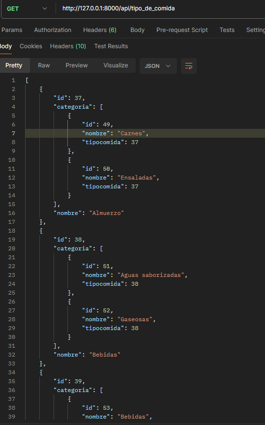
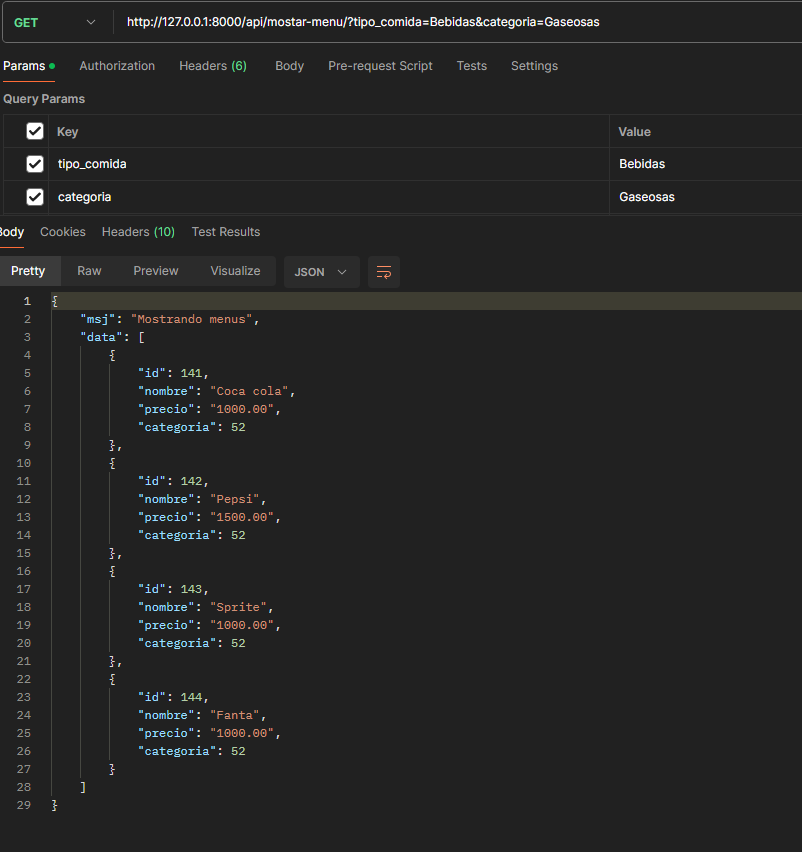
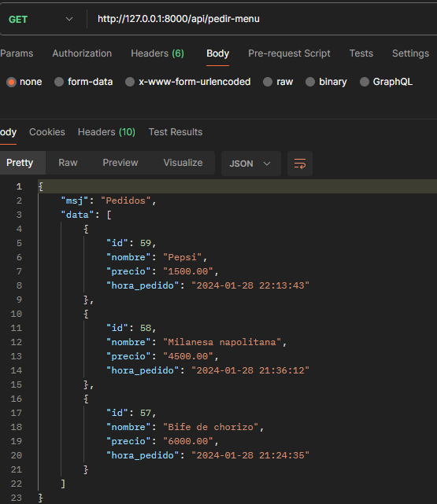
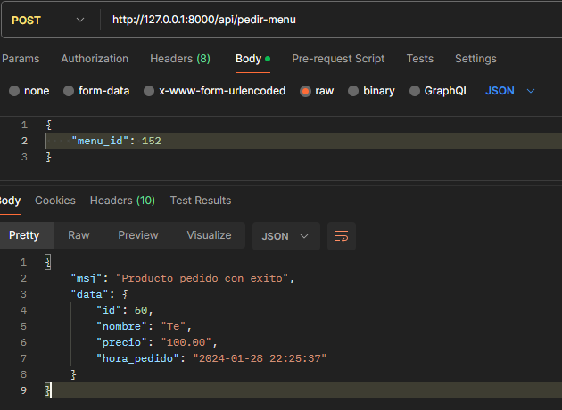
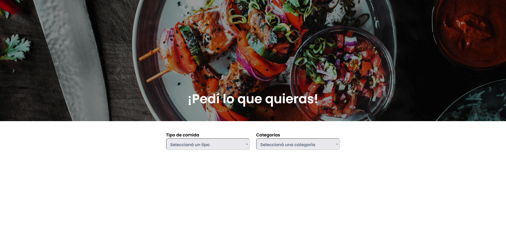
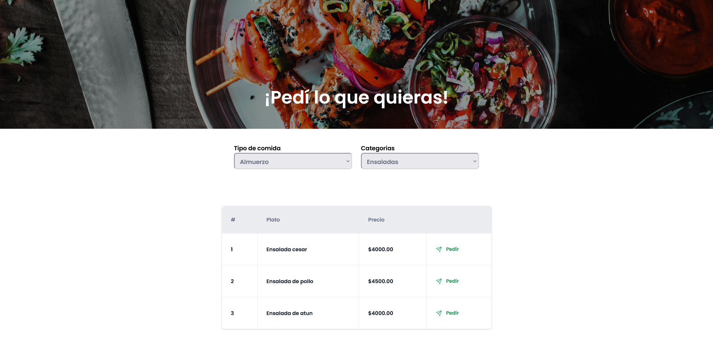
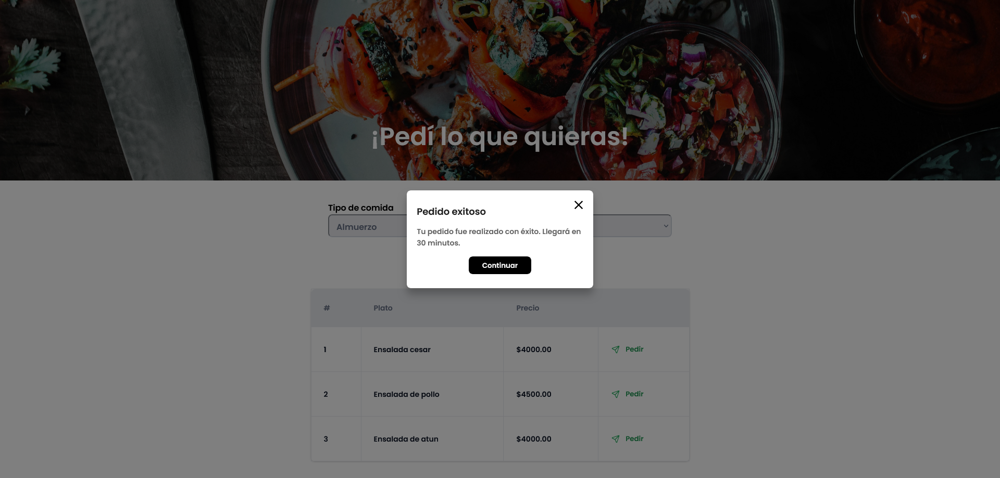
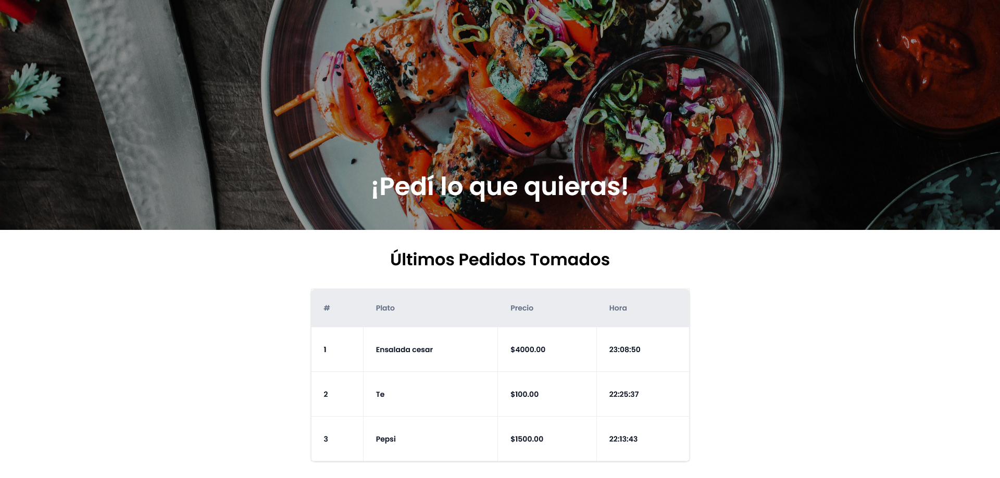

# Comida App

App de pedido de comidas
- Almuerzos
- Bebidas
- Desayunos
- Meriendas


### Descripción

APIRest para consultar las comidas con sus categorias y menus y pedir una comida

## Configuracion del Backend 
Crear un entorno virutal en la carpeta comida-backend
```bash
  python -m venv venv  #crea un entorno virtual

  pip install -r requirements.txt # Instalar las dependencias para el proyecto

  python manage.py migrate #Ejecuta las migraciones para aplicar los cambios en la base de datos

  python manage.py runserver #Iniciar proyecto

```
Configurar las variables de entorno .env (en este caso funciona con MySQL)
```bash
    DB_CONNECTOR=
    DB_USER=
    DB_PASSWORD=
    DB_IP_ADDRESS=
    DB_NAME=
    DB_HOST=
    DB_PORT=
```

## Configuracion del Frontend
Para iniciar primero instalas las dependencias
```
    npm run i
```
Tambien configurar las variables de entorno .env
```
    # URL del backend levantado
    VITE_BACKEND_URL=
```

En la carpeta ./comida-backend/ ejecutar un archivo py llamado insertar_datos.py para asi registrar los datos a la base.

Tambien hay otro archivo test_db_conn.py para probar la conexion a la base.

```
  Ruta ./comida-backend/insertar_datos.py

  python insertar_datos.py
```

## API Reference

#### Obtener las comidas con sus categorias

```http
  GET /api/tipo_de_comida
```



#### Obtener los menus segun el tipo de comida y categoria seleccionada

```http
  GET /api/mostar-menu/?tipo_comida=Bebidas&categoria=Gaseosas
```

| Parameter | Type     | Description                       |
| :-------- | :------- | :-------------------------------- |
| `tipo_comida`      | `string` | **Required** |
| `categoria`      | `string` | **Required** |




### Obtener las comidas pedidas

```http
  GET /api/pedir-menu
```



### Pedir una comida segun el id del menu

```http
  POST /api/pedir-menu

  Body
  {
    "menu_id": 123 #numero del menu
  }
```




# Ejemplos en el FrontEnd

### Pagina principal


### Tipos de comidas


### Pedido de comidas


### Ultimos 3 pedidos
